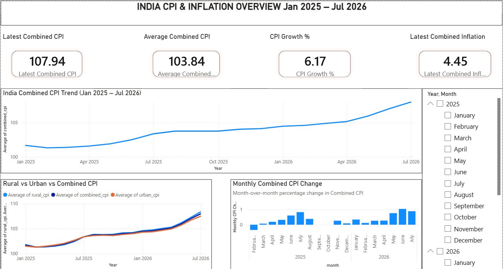
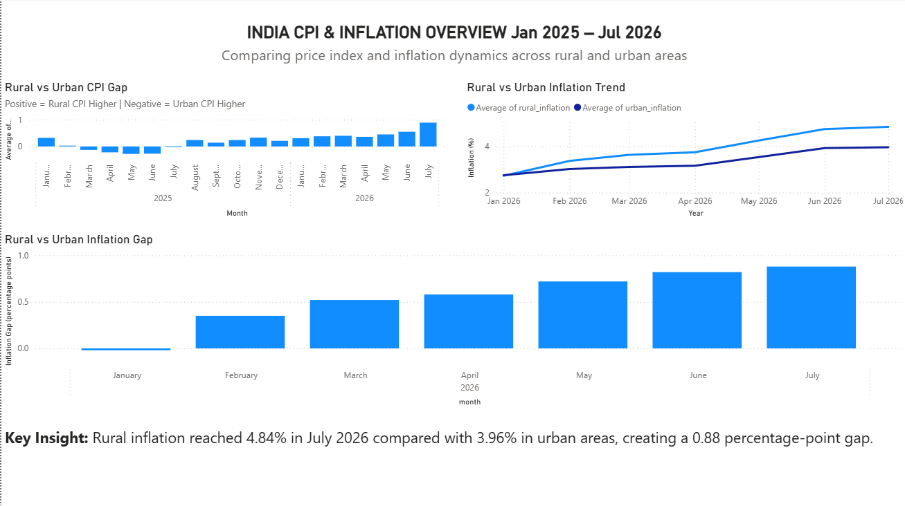
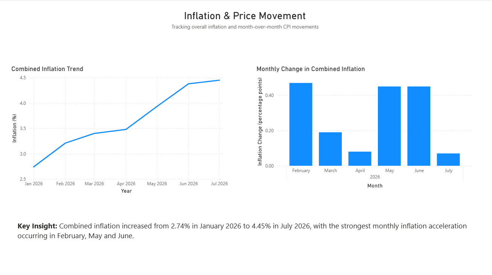

# India CPI & Inflation Analysis Dashboard

> A Data Analytics portfolio project using Government of India Consumer Price Index (CPI) and inflation data, Excel, Power BI, and DAX.

**Tools:** Excel · Power BI · DAX  
**Project type:** Exploratory Data Analysis & Business Intelligence  
**Period:** January 2025 – July 2026  
**Frequency:** Monthly

## 1. Project Overview

This project analyzes monthly CPI and inflation data to understand how India's general price index changed between January 2025 and July 2026.

The analysis focuses on:
- Overall Combined CPI trends
- Rural vs. urban CPI differences
- Inflation trends during 2026
- Month-over-month CPI movements
- Rural–urban inflation differences
- Data-driven findings communicated through a Power BI dashboard

The final output is a 3-page Power BI dashboard supported by Excel data preparation and DAX measures.

## 2. Analytical Questions

1. How has Combined CPI changed from January 2025 to July 2026?
2. How do rural and urban CPI trends differ?
3. How has Combined inflation changed during 2026?
4. Which months experienced the largest CPI movements?
5. How large is the rural–urban inflation gap?
6. What major patterns are visible in the data?

## 3. Dataset

| Column | Meaning |
|---|---|
| `month` | Month and year of observation |
| `rural_cpi` | CPI index for rural areas |
| `urban_cpi` | CPI index for urban areas |
| `combined_cpi` | Combined CPI index |
| `rural_inflation` | Rural inflation rate |
| `urban_inflation` | Urban inflation rate |
| `combined_inflation` | Combined inflation rate |

- **Period:** January 2025 – July 2026
- **Observations:** 19 monthly records
- **Latest observation:** July 2026
- **July 2026:** Provisional

**Source:** Government of India CPI/inflation data. Add the exact source URL used for your downloaded dataset before publishing.

## 4. CPI vs. Inflation

**CPI** is an index measuring changes in the price level of a representative basket of consumer goods and services.

**Inflation** is the rate at which prices increase over time.

A useful distinction is:

- **CPI → price index level**
- **Inflation → rate of price increase**

## 5. Data Preparation

The dataset was prepared in Excel before importing it into Power BI.

### Cleaning and validation
- Reviewed structure and data types
- Standardized the month field
- Converted CPI and inflation fields to numeric values
- Investigated missing values
- Checked minimum and maximum CPI values
- Validated calculated values
- Created analytical fields for Power BI

### Missing values

Inflation values were blank for the provided observations from January 2025 through December 2025, while inflation values were available from January 2026 onward.

The blanks were **not replaced with zero** because a blank means the value is unavailable in the supplied dataset, whereas zero would imply measured inflation was actually 0%.

## 6. Feature Engineering

### Rural–Urban CPI Gap
```text
Rural CPI − Urban CPI
```

### Combined CPI Month-over-Month Change
```text
Current Month Combined CPI − Previous Month Combined CPI
```

### Combined CPI Month-over-Month Percentage
```text
(Current Month CPI − Previous Month CPI) / Previous Month CPI × 100
```

## 7. Power BI Dashboard

### Page 1 — India CPI & Inflation Overview
Provides a high-level view using:
- Latest Combined CPI KPI
- Latest Combined Inflation KPI
- CPI Growth KPI
- Average Combined CPI KPI
- Combined CPI trend
- Rural vs. Urban vs. Combined CPI
- Monthly Combined CPI movement

### Page 2 — Rural vs. Urban Analysis
Compares:
- Rural–Urban CPI Gap
- Rural vs. Urban Inflation Trend
- Rural–Urban Inflation Gap
- Key Insight

### Page 3 — Inflation & Price Movement
Focuses on:
- Combined Inflation Trend
- Monthly CPI/inflation movement
- Key Findings
- Data source and period note

## 8. Key Performance Indicators

| KPI | Result |
|---|---:|
| Latest Combined CPI | **107.94** |
| Latest Combined Inflation | **4.45%** |
| CPI Growth Since Jan-25 | **~6.17%** |
| CPI Increase Since Jan-25 | **6.27 points** |
| Maximum Monthly CPI Increase | **1.03%** |
| Minimum Monthly CPI Change | **-0.34%** |
| Latest Rural–Urban Inflation Gap | **0.88 percentage points** |

## 9. Key Findings

### Overall CPI increased
Combined CPI increased from **101.67 in January 2025** to **107.94 in July 2026**, an increase of **6.27 CPI points**, or approximately **6.17% growth**.

### Inflation increased during 2026
Combined inflation increased from **2.74% in January 2026** to **4.45% in July 2026**, an increase of **1.71 percentage points**.

### June 2026 had the largest monthly CPI increase
The largest month-over-month Combined CPI increase was **1.03% in June 2026**.

### February 2025 had the largest monthly decline
The largest negative month-over-month CPI movement was approximately **-0.34% in February 2025**.

### Rural inflation exceeded urban inflation
In July 2026:
- Rural inflation = **4.84%**
- Urban inflation = **3.96%**
- Gap = **0.88 percentage points**

This indicates higher rural inflation than urban inflation in the latest observation.

## 10. Business Interpretation

The data shows a general upward movement in Combined CPI during the study period, with stronger inflationary pressure visible during 2026. Rural inflation also exceeded urban inflation in the latest observation.

These findings describe observed patterns and do not establish the economic causes behind them.

## 11. Dashboard Screenshots

Add screenshots to the repository and update these paths:

```text
screenshots/overview.png
screenshots/rural_urban.png
screenshots/inflation_analysis.png
```






## 12. Tools & Technologies

### Excel
- Data inspection
- Data cleaning
- Missing-value investigation
- Feature engineering
- Initial validation

### Power BI
- Interactive dashboard development
- KPI cards
- Trend analysis
- Comparative analysis
- Conditional formatting
- Report design

### DAX
- Dynamic KPI measures
- Latest-value calculations
- Growth calculations
- Monthly movement analysis
- Rural–urban comparisons

## 13. Skills Demonstrated

**Data Analytics**
- Data cleaning and validation
- Exploratory and trend analysis
- Comparative analysis
- KPI development
- Data storytelling
- Insight generation

**Power BI**
- Report design
- Visual selection
- KPI cards
- Interactive filtering
- Conditional formatting
- Dashboard layout

**DAX**
- `CALCULATE`
- `AVERAGE`
- `MAX`
- `MIN`
- `FIRSTDATE`
- `LASTDATE`
- `DIVIDE`
- `VAR`

## 14. Project Architecture

```text
Government CPI Dataset
        |
        v
   Excel Preparation
        |
        +-- Data inspection
        +-- Missing-value investigation
        +-- Data-type correction
        +-- Feature engineering
        |
        v
    Clean Dataset
        |
        v
      Power BI
        |
        +-- DAX Measures
        +-- KPI Cards
        +-- Trend Analysis
        +-- Rural vs Urban Analysis
        +-- Inflation Analysis
        |
        v
 Interactive Dashboard
        |
        v
   Key Insights
```

## 15. Limitations

- The dataset covers only January 2025 to July 2026.
- There are 19 monthly observations.
- Inflation observations are unavailable for the provided 2025 rows.
- The data is aggregate CPI/inflation data and does not contain commodity-level or mandi-level prices.
- July 2026 figures are provisional.
- The analysis identifies patterns but does not establish causal relationships.

## 16. Future Improvements

### Short term
- Add state-wise CPI and inflation analysis
- Add geographic visualizations
- Extend the historical period
- Add more detailed inflation comparisons

### Intermediate
- Analyze CPI by category
- Compare food and non-food inflation
- Investigate seasonal patterns
- Add forecasting

### Advanced
Integrate CPI analysis with commodity and mandi-level prices:

```text
State
  |
  v
District
  |
  v
Mandi
  |
  v
Commodity
  |
  v
Variety
  |
  v
Daily Price
```

This would support a future **Mandi Price Volatility & Market Opportunity Dashboard**.

## 17. Repository Structure

```text
India-CPI-Inflation-Analysis/
|
+-- README.md
|
+-- data/
|   +-- raw/
|   |   +-- CPI_raw.xlsx
|   |
|   +-- cleaned/
|       +-- CPI_cleaned.xlsx
|
+-- powerbi/
|   +-- India_CPI_Inflation_Dashboard.pbix
|
+-- screenshots/
|   +-- overview.png
|   +-- rural_urban.png
|   +-- inflation_analysis.png
|
+-- documentation/
    +-- DAX_Measures.md
```

## 20. Project Status

**Completed — Beginner Data Analytics Portfolio Project**

### Next progression

**Project 2 → State-wise CPI & Inflation Analysis**

**Advanced portfolio project → Mandi Price Volatility & Market Opportunity Dashboard**
